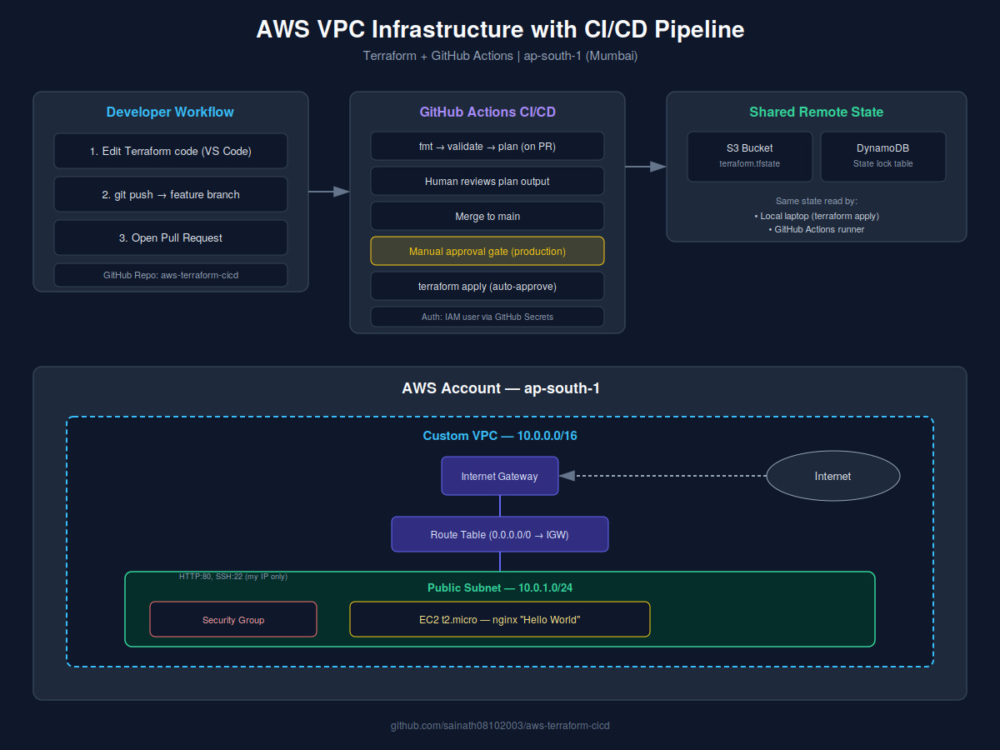

# AWS VPC Infrastructure with CI/CD Pipeline

A custom AWS network — VPC, subnet, internet gateway, route table, and an EC2 web server — provisioned entirely with Terraform, with a GitHub Actions pipeline that plans every pull request and applies changes to `main` only after manual approval.



## What this project demonstrates

- Building AWS networking from scratch instead of relying on the default VPC
- Least-privilege IAM instead of admin credentials for automation
- Remote, shared Terraform state (S3 + DynamoDB locking) so a laptop and a CI runner never disagree about what's already deployed
- A real CI/CD gate: automated `plan` on every PR, human-approved `apply` on merge

## Architecture

| Layer | Resource | Purpose |
|---|---|---|
| Networking | VPC (`10.0.0.0/16`) | Isolated network space |
| Networking | Public Subnet (`10.0.1.0/24`) | Where the EC2 instance lives |
| Networking | Internet Gateway | Gives the VPC a path to/from the internet |
| Networking | Route Table | Routes `0.0.0.0/0` traffic to the IGW |
| Compute | EC2 (`t2.micro`) | Runs nginx, serves a "Hello World" page |
| Security | Security Group | Allows HTTP (80) from anywhere, SSH (22) from one IP only |
| State | S3 + DynamoDB | Shared, locked Terraform state |
| IAM | `terraform-deployer` | Least-privilege user scoped to EC2, S3, IAM (roles only), DynamoDB (lock table only) |

## CI/CD flow

1. Push a feature branch, open a pull request
2. GitHub Actions runs `terraform fmt -check`, `validate`, and `plan` — the plan output shows exactly what would change, before anything touches AWS
3. Merge the PR
4. GitHub Actions `apply` job triggers, but **pauses** at a required-reviewer gate on the `production` environment
5. Manually approve the deployment in the Actions tab
6. Terraform applies the change using the same remote state the local machine uses, so nothing gets duplicated or recreated

## Setup

```bash
git clone https://github.com/sainath08102003/aws-terraform-cicd.git
cd aws-terraform-cicd/terraform

# generate an SSH key pair for the EC2 instance (public key only is committed)
ssh-keygen -t rsa -b 4096 -f ~/.ssh/terraform-key -N ""
cp ~/.ssh/terraform-key.pub .

terraform init
terraform plan -var="my_ip=$(curl -s ifconfig.me)/32"
terraform apply -var="my_ip=$(curl -s ifconfig.me)/32"
```

For GitHub Actions to run, add these as **repository secrets**:
- `AWS_ACCESS_KEY_ID`
- `AWS_SECRET_ACCESS_KEY`

## Lessons learned (the honest version)

This project didn't work on the first try, and that's part of the point — most of what's below only became clear by hitting it directly.

- **Local Terraform state doesn't scale to CI.** A GitHub Actions runner is a fresh machine every time — if state only lives on your laptop, the runner has no idea anything already exists, and will try to recreate everything from scratch.
- **`terraform init` needs credentials too, once you're on a remote backend** — not just `plan`/`apply`. Easy to miss if credentials are only wired into later steps.
- **Deleting and recreating a broken secret is more reliable than "updating" it** — GitHub's update flow can silently keep a bad value if the new one didn't fully register.
- **IAM least-privilege policies need revisiting as the project grows.** Adding DynamoDB-based state locking later meant going back and adding a scoped `dynamodb:*` statement — the original policy only anticipated EC2/S3/IAM.
- **AMI IDs and file paths (`file()`) are environment-specific.** A `~/.ssh/...` path that works locally doesn't exist on a CI runner; committing the public key into the repo and referencing it with `${path.module}` fixed this permanently.

## Cleanup

```bash
cd terraform
terraform destroy -var="my_ip=<your-ip>/32"
```

Also worth deleting manually if you're done for good: the S3 state bucket, the DynamoDB lock table, and the `terraform-deployer` IAM user's access keys.

## Tech stack

Terraform · AWS (VPC, EC2, IAM, S3, DynamoDB) · GitHub Actions · nginx
